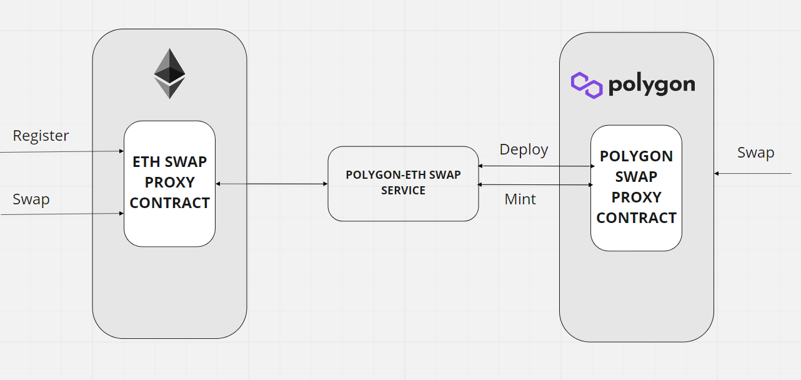
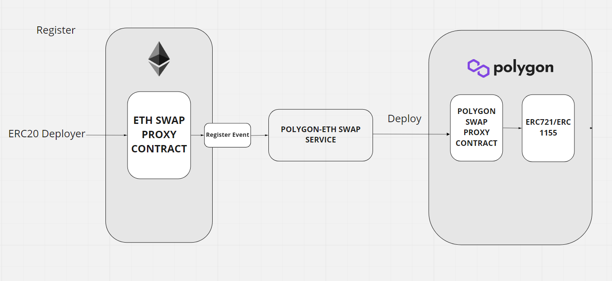
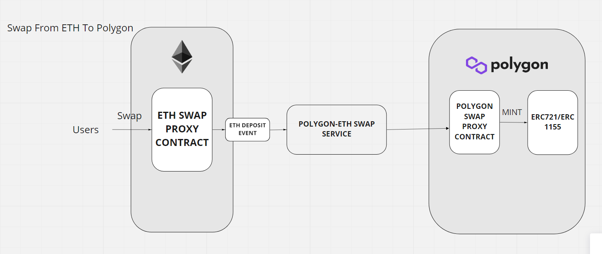
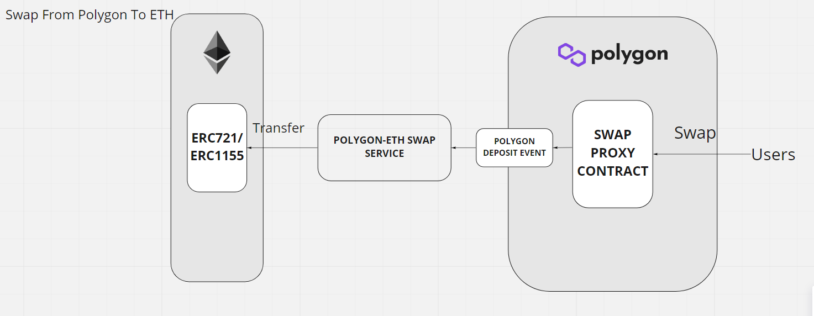

# NIFTY BRIDGE🌉

Cross Chain NFT Bridge For Ethereum <-> Polygon <->BSC <-> Other EVM Compatible Chains😲.

## Motivation

The NFT market is now worth more than $7 billion. That's a big increase from monthly sales volume of about $400 million at the start of the year, and it has helped drive the market cap of the NFT universe to about $7 billion. A Cross-chain NFT bridge (ERC721/ERC1155) can increase the liquidity of NFTs across multiple chains. With the booming NFT market right now, it is a highly sought-after feature for EVM compatible chains.

## How It Works?

### Architecture

I have deployed two swap contracts on both ETH and POLYGON, then maintaining a POLYGON-ETH swap service to handle token registrations and swap requests. To list an ERC721 token in this swap system, anyone can call the register method on ETH and the swap service will do some checks on it. Once all checks are passed, a [canonical ERC721/ERC1155 token](https://github.com/Pranav543/nifty_bridge/blob/main/contracts/contracts/tokens/MirroredERC721.sol) will be deployed. The name of the  token will append a postfix: “ mirrored from ETH”. Then users can swap their token bi-directionally.

### Register

1. Anyone can call the register method to register a ERC721/ERC1155 and an event will be emitted.
2. POLYGON-ETH-Swap service will do some checks about the event.
    1. The register transaction should be from the ERC721/1155 deployer. If not, the register will be ignored.
    2. The swap service will ensure the contract is a valid ERC721/1155 token.
    3. If an ERC721/1155 is already registered, all other registrations transactions on it will fail.
4. If all checks are passed, the POLYGON-ETH-Swap service will call POLYGON swap proxy contract to issue an ERC721/1155 contract. The initial supply is zero and the swap proxy contract has the authority to mint the ERC721/1155 token.

### Swap From ETH To POLYGON

1. Users call the swap method to deposit ERC721/1155 to the swap service’s ETH account.  Zero swap fee will be charged.Then a deposit event will be emitted.
2. POLYGON-ETH-Swap service will monitor deposit events on ETH and do some checks.
3. If all checks are passed, the swap service will send a transaction to mint ERC721/1155 token to the swap requester.

### Swap From POLYGON To ETH

1. Users call the swap method to deposit ERC721/1155 to the POLYGON swap contract. Users need to pay swap fee. The deposited token will be burned immediately and emit an deposit event.
2. POLYGON-ETH-Swap service will monitor deposit events on POLYGON and do some checks.
3. If all checks are passed, the swap service will send a transaction to transfer the ERC721/1155 token to the swap requester.
4. The POLYGON account has the authority to charge the swap fee.
